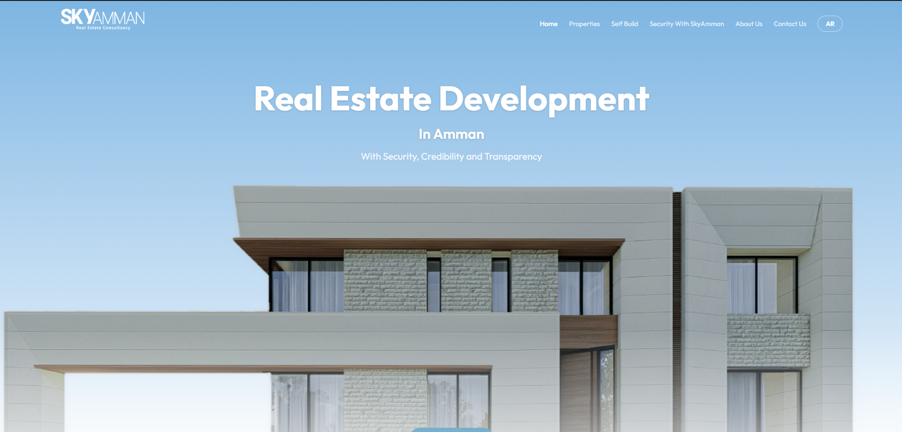

# Sky Amman



Corporate website and content management system for **Sky Amman**, a real estate consultancy based in Amman, Jordan. The site covers property listings, investment opportunities, self-build services, and lead capture — all managed through a bilingual (English / Arabic) admin panel.

---

## Tech Stack

| Layer | Technology |
|---|---|
| Backend | Laravel 12 (PHP 8.2) |
| Frontend | React 19 + TypeScript via Inertia.js |
| Styling | TailwindCSS v4 |
| Database | MySQL (production) · SQLite (local dev) |
| Rendering | SSR via FrankenPHP |
| Hosting | Railway |
| CDN / DNS | Cloudflare |
| Mail | Resend |
| Bot protection | Cloudflare Turnstile |

---

## Local Development

### Requirements

- PHP 8.2+
- Composer
- Node.js 22+
- npm

### Setup

```bash
# Install dependencies
composer install
npm install

# Environment
cp .env.example .env
php artisan key:generate

# Database (SQLite for local dev)
touch database/database.sqlite
php artisan migrate --seed

# Start servers (two terminals)
php artisan serve
npm run dev
```

App runs at `http://localhost:8000`.

Admin panel: `http://localhost:8000/admin/login`

> Default admin credentials are created by `AdminUserSeeder`. Change them before any non-local deployment.

---

## Environment Variables

Copy `.env.example` and fill in the values below. Never commit `.env` to version control.

| Variable | Description |
|---|---|
| `APP_KEY` | Generated by `php artisan key:generate` |
| `APP_URL` | Full URL of the app (e.g. `https://skyamman.com`) |
| `DB_CONNECTION` | `sqlite` for local, `mysql` for production |
| `SESSION_DRIVER` | `database` — required in production (Railway FS is ephemeral) |
| `MAIL_MAILER` | `resend` in production, `log` in local dev |
| `RESEND_API_KEY` | From the Resend dashboard |
| `MAIL_FROM_ADDRESS` | Verified sending address on your Resend domain |
| `TURNSTILE_SITE_KEY` | Cloudflare Turnstile site key (leave empty in local dev to disable) |
| `TURNSTILE_SECRET_KEY` | Cloudflare Turnstile secret key |
| `INERTIA_SSR_ENABLED` | `true` in production, omit or `false` in local dev |

---

## Key Features

- **Bilingual** — English and Arabic, toggled per session (no auto-detect). RTL layout handled via CSS logical properties.
- **Public pages** — Homepage, Properties listings + detail pages, Self Build, Security with Sky Amman, About Us, Contact Us.
- **Admin CMS** — bilingual site content editor, project CRUD with gallery, settings, contact submissions inbox, change log with per-entry revert + undo toast.
- **Project catalogue** — unified listings table with category (`under_development / ready / investment_opportunity`) and listing status (`for_sale / for_rent / sold / reserved`).
- **SEO** — per-page and per-project SEO fields, dynamic sitemap, structured data (JSON-LD), hreflang, OG tags.
- **Security** — Cloudflare Turnstile on all public forms, rate limiting, CSP headers, session-based auth with per-email throttle.

---

## Database

```bash
# Fresh reset with seed data
php artisan migrate:fresh --seed

# Production (Railway runs this automatically on deploy)
php artisan migrate --force
```

Data migrations (`database/migrations/2026_06_18_*`) bootstrap essential seed data (admin user, settings, pages, content, project catalogue) on first deploy. Subsequent deploys skip them.

---

## Build

```bash
# Production build (client + SSR)
npm run build
```

Output: `public/build/` (client) and `bootstrap/ssr/` (SSR bundle).

---

## Deployment

Hosted on **Railway** with the Railpack builder. On each deploy Railway automatically runs:

```
php artisan migrate --force
php artisan storage:link
php artisan optimize:clear
php artisan optimize
```

Static assets are served behind **Cloudflare** (DNS + proxy). Cache purge may be required after deploying new assets.

---

## Mail

Transactional email (contact form leads, password resets) is sent via **Resend**. The sending domain must be verified in the Resend dashboard (DKIM, SPF, DMARC records added in Cloudflare DNS) before emails will be delivered.

In local development, set `MAIL_MAILER=log` — emails are written to `storage/logs/laravel.log` instead of being sent.

---

## License

Private — all rights reserved. Not open source.
